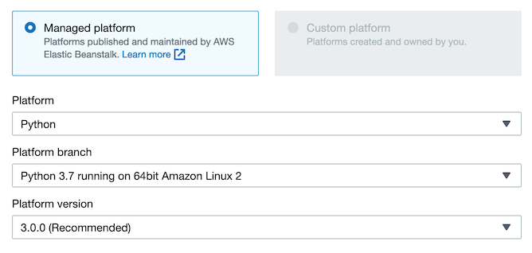

Set up Let's Encrypt certs on an Elastic Beanstalk instance, using Route 53 for domain validation.

* *01_setup.config* - opens up port 443 in AWSEBSecurityGroup, adds route 53 role permissions
* *02_https-instance.config* installs/runs certbot, configures `/etc/httpd/conf.d/ssl.conf`
* *03_cron.config* schedules the renewal, optionally posts messages to a slack web hook.

Designed to work with Python 3.7 running on 64bit Amazon Linux 2 (nginx).

Takes two configuration environment variables `CERT_DOMAIN` and `SLACK_WEB_HOOK`.

Handy references:
 * https://certbot.eff.org/docs/using.html
 * https://certbot-dns-route53.readthedocs.io/en/stable/
 * https://docs.aws.amazon.com/elasticbeanstalk/latest/dg/platforms-linux-extend.html
 
Lots of inspiration from: https://github.com/Archinowsk/konsti-server/tree/master/.ebextensions
